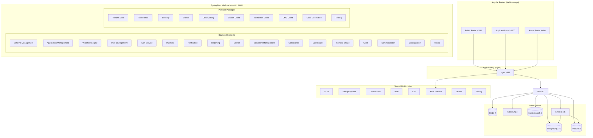

# System Architecture

## Overview

The AVGC-XR Portal follows a **modular monolith** architecture with hexagonal design within each bounded context. The system is built for the Tamil Nadu government's AVGC-XR initiative under ELCOT.

## Architecture Diagram

## Key Decisions

See `adr/` directory for Architecture Decision Records.